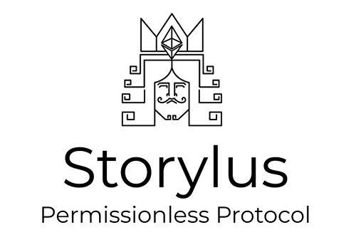
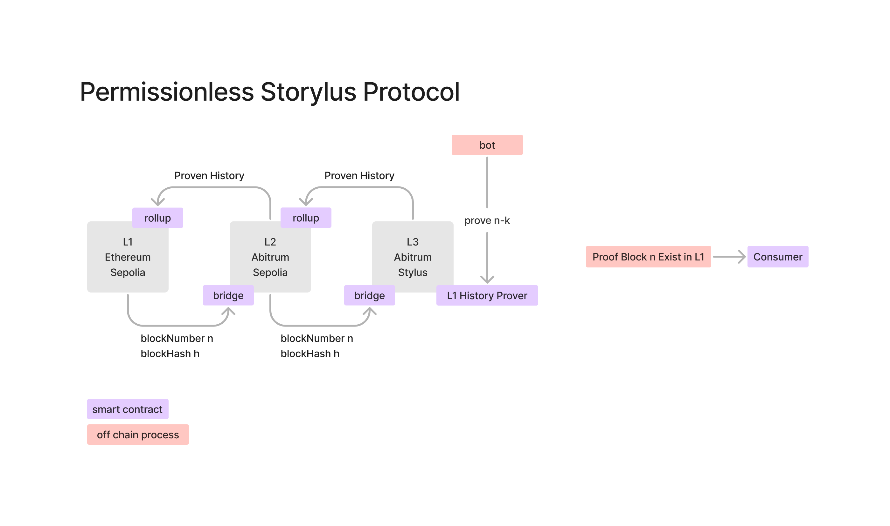
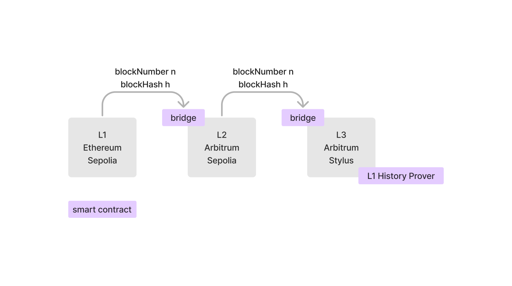
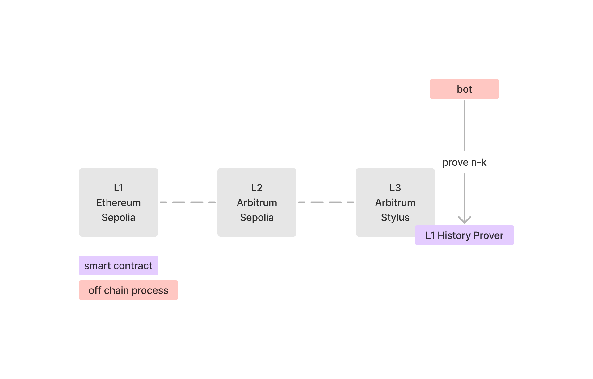
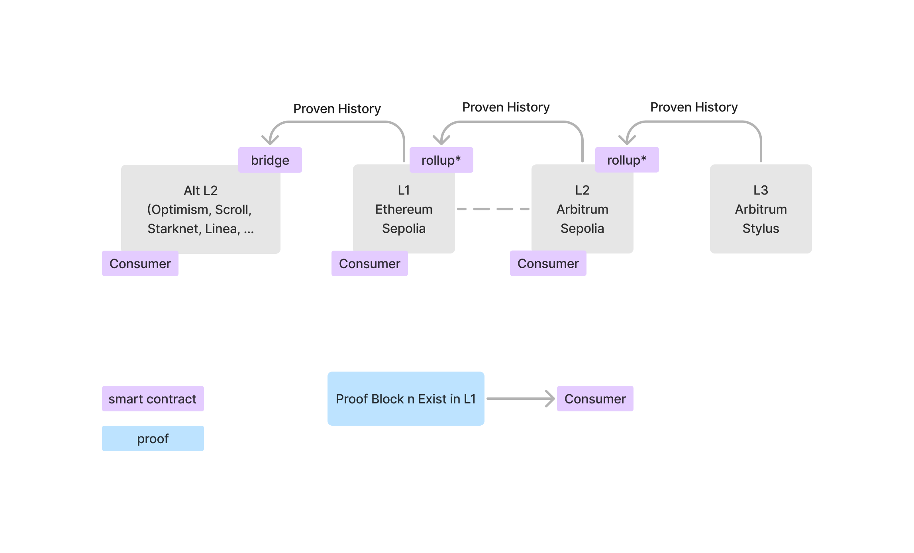

## What is Storylus?

Storylus is a permissionless Protocol that gives smart contracts access to all of Ethereum’s historical data with storage proofs by Proving Ethereum’s chain of block.

## Why Storylus ?

There is no native way to access historical state on Ethereum in a trustless way.
Over 19 million blocks written to Ethereum. Smart contracts can only access the latest 256 blocks representing ~50 minutes of data.
‘Historical data’ refers to anything outside of the last 256 blocks.

## Deployed Contract

### Sepolia

### Stylus

## Uses cases examples

- Confirm past user asset ownership
- Proof of usage of a protocol
- bypass the need for bridging
- …

## Code Highlights

- [History Prover Smart Contract](https://github.com/cometh-hq/optimistic-eth-history-prover/tree/main/l3contracts/src)
- [Rust Bot to fill L1 Data](https://github.com/cometh-hq/optimistic-eth-history-prover/tree/main/bot)
- [Claimer (proofs verifier)](https://github.com/cometh-hq/optimistic-eth-history-prover/blob/main/l2contracts/src/ClaimNFT.sol)
- [Hasher Lib (Recover Signer from Tx)](https://github.com/cometh-hq/optimistic-eth-history-prover/blob/main/l2contracts/src/libs/TransactionHasher.sol)
- [TX Trie implementation](https://github.com/cometh-hq/optimistic-eth-history-prover/blob/main/demo/app/lib/utils/trie.ts)
- [Demo Frontend](https://github.com/cometh-hq/optimistic-eth-history-prover/tree/main/demo) and [NFT](https://github.com/cometh-hq/optimistic-eth-history-prover/blob/main/l2contracts/src/ETHDenverBuilder.sol)

## Protocol Usage Demo
The demo is a Capture the (nft) Flag
The NFT is transferred only if an address proves on-chain that it has made more transactions than the current NFT owner during EthDenver
More than 256 Blocks in the past

- [Code](https://github.com/cometh-hq/optimistic-eth-history-prover/tree/main/demo)
- [Live Demo](https://optimistic-eth-history-prover.vercel.app/)

## How it works

### Protocol overview

### 1- Push a L1 Block Header to l3 in a trustless way 

### 2- Recursively prove previous blocks

### 3- All networks that have access to the L3 Rollup state can now attest the validity of a L1 block.

## Context

This project was developed during the EthDenver 2024 hackathon

